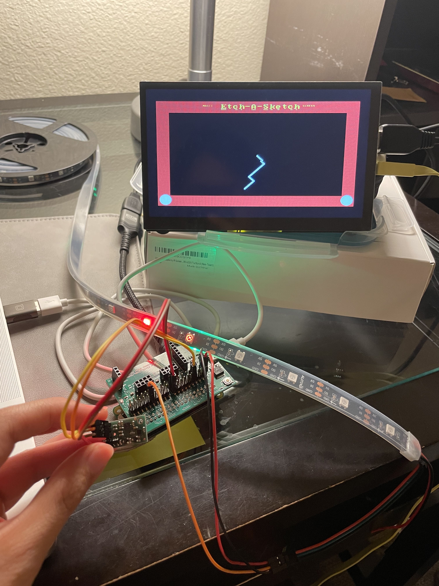

# 140E OS Final Project

An Etch-a-Sketch game that is controlled by an accelerometer. 



The game is displayed on a small LED display. Users tilt the accelerometer up, down, right, and left to control the movement of the Etch-a-Sketch pen. They shake the accelerometer to clear the screen, which will turn the drawing line to be a different color. This mimics the controls of the original Etch-a-Sketch game.

## Setup
### Compiler
Raspberry Pi uses ARM architecture. Install ARM cross-compiler toolchain.
```
brew tap ArmMbed/homebrew-formulae
brew install arm-none-eabi-gcc
```
Alternatively, use [cs107 install notes](http://cs107e.github.io/guides/install/mac/)

### libpi/libunix
This requires the [140E lab]() libpi and libunix directories. Copy the libpi and libunix directories into the root directory.

## Run

Run `make` in the src directory

## Devices

- Display Screen ([Any HDMI](https://www.amazon.com/gp/product/B0B8S9DYQC))
- IMU ([MinIMU9-v5](https://www.pololu.com/product/2738))
- Neopixels ([WS2812B](https://www.amazon.com/gp/product/B00ZHB9M6A))

